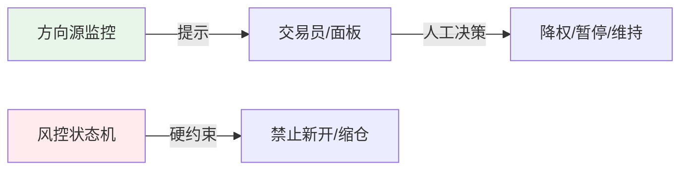

# 方向源监控

## 背景

### 问题起源

四维策略的回测与实盘使用不同的方向源：

- **回测**：使用日线级别 T 分数（`T_D`）定方向
- **实盘**：使用 5 分钟级别 T 分数（`T_5m`）定方向

经 4070 日样本统计，二者方向分歧率高达 **48.4%**。这意味着回测结论可能建立在与实盘不一致的方向源上，构成「红线①」风险。

### 探针结论

通过「统一方向源到 T_5m」的对照实验验证：6/6 核心改进在统一方向源后仍然成立。因此：

> 红线①降级为「已知偏差、可量化管理」，不推翻策略框架，但需要运行时监控以确保偏差在可接受范围内。

---

## 模块定位

`direction_source_monitor.py` 模块将 T_D 与 T_5m 的方向分歧做成**可量化、可告警的运行时监控**。

```mermaid
graph LR
    subgraph 输入
        TD[T_D 日线方向]
        T5M[T_5m 5分钟方向]
        SYM[品种代码]
    end

    subgraph 监控核心
        DIV[divergence()<br/>单笔一致性判断]
        TRK[DivergenceTracker<br/>滚动统计分歧率]
        ALERT[alert_level()<br/>告警级别判定]
    end

    subgraph 输出
        RATE[分歧率]
        LEVEL[告警级别]
        SA[SA专项分歧率]
    end

    TD --> DIV
    T5M --> DIV
    SYM --> TRK
    DIV --> TRK
    TRK --> ALERT
    ALERT --> RATE
    ALERT --> LEVEL
    ALERT --> SA
```

### 设计要点

- **纯函数 + 单例 tracker**：runner 每轮调用 `alert_level()` 即可，零副作用风险
- **只告警、不阻断**：分歧率超基线仅提示降权，不阻断信号生成（改进对方向源不敏感）
- **SA 专项**：SA 品种单独维护一个统计序列，面板可单独查看

---

## 单笔分歧判断

### `divergence(T_D, T_5m)`

判断单笔方向一致性：

| 情况 | 返回值 | 说明 |
|---|---|---|
| T_D 与 T_5m **同号**（都正或都负） | `True` | 方向一致 |
| T_D 与 T_5m **异号** | `False` | 方向分歧 |
| 任一方无方向（= 0） | `None` | 无法判断，不计入统计 |

```python
# 方向离散化
d = 1 if T_D > 0 else (-1 if T_D < 0 else 0)
m = 1 if T_5m > 0 else (-1 if T_5m < 0 else 0)

# 判断
if d == 0 or m == 0:
    return None  # 任一方无方向，跳过
return d == m  # 同号 True，异号 False
```

---

## 滚动分歧率统计

### `DivergenceTracker` 类

维护滚动窗口内的方向一致性序列，计算分歧率。

#### 数据结构

| 字段 | 类型 | 说明 |
|---|---|---|
| `window` | int | 滚动窗口大小，默认 200 笔 |
| `samples` | list[bool] | 全品种一致性序列（True=同号，False=异号） |
| `sa_samples` | list[bool] | SA 专项一致性序列（独立统计） |
| `last` | dict | 最近一次 summary 快照 |

#### 分歧率计算

```
divergence_rate = 1.0 - sum(samples) / len(samples)
```

即：异号样本占总样本的比例。值越大，分歧越严重。

#### 更新方法

```python
tracker.update(symbol, T_D, T_5m)
```

1. 调用 `divergence()` 计算单笔一致性
2. 若结果为 `None`（任一方无方向），直接返回当前 summary，不追加样本
3. 将结果追加到 `samples`（全品种）
4. 若 `symbol == "SA"`，同时追加到 `sa_samples`
5. 超出窗口大小时移除最旧样本
6. 返回最新 summary

---

## 告警级别

### 告警阈值

| 级别 | 分歧率阈值 | 建议动作 |
|---|---|---|
| **OK** | < 0.55 | 正常交易 |
| **WARN** | ≥ 0.55 | 信号降权（建议降低仓位） |
| **HIGH** | ≥ 0.65 | 建议暂停新开 / 人工复核 |

### 基准线

| 参数 | 值 | 说明 |
|---|---|---|
| `BASELINE_DIVERGENCE` | 0.484 | 全样本回测实测分歧率（4070 日） |
| `WARN_DIVERGENCE` | 0.55 | WARN 级别阈值，比基线高约 6.6 个百分点 |
| `HIGH_DIVERGENCE` | 0.65 | HIGH 级别阈值，比基线高约 16.6 个百分点 |

!!! note "基线 vs 告警线"
    基线分歧率为 48.4%（接近五五开），这是已知的、已被探针验证为可接受的偏差。只有当滚动分歧率显著高于基线时才告警，提示当前市场环境下方向源偏差异常扩大。

### summary 返回结构

```python
{
    "divergence_rate": 0.512,  # 全品种滚动分歧率（None=样本不足）
    "baseline": 0.484,  # 回测基准分歧率
    "level": "OK",  # 告警级别：OK / WARN / HIGH
    "sa_divergence_rate": 0.487,  # SA 专项分歧率（None=无SA样本）
    "sa_sensitive": True,  # SA 是否为敏感品种
    "n": 150,  # 当前样本量
}
```

---

## SA 品种特殊处理

### 为什么 SA 特殊？

回测结论（2026-08-16）显示：

> **SA 对方向源（T_D vs T_5m）最敏感** — 方向源的选择对 SA 策略表现的影响大于其他品种。

因此 SA 被标记为方向源敏感品种（`SA_SENSITIVE = True`），在监控中单独维护统计序列。

### SA 专项监控

- `sa_samples`：独立于全品种的 SA 专属一致性序列
- `sa_divergence_rate`：SA 专项分歧率，面板可单独展示
- 当 SA 分歧率异常升高时，可针对性地对 SA 采取降权或暂停措施

### 在风控体系中的位置

SA 品种专项风控是跨模块的：

| 模块 | SA 特殊处理 |
|---|---|
| `direction_source_monitor` | 独立分歧率统计 + 敏感度标记 |
| `risk_state_machine` | `SA_SENSITIVE` 常量标记 |
| `four_dim_strategy` | 支持逐合约信号（SA01 等具体交割合约独立出信号） |

---

## 使用方式

### Runner 集成

```python
import direction_source_monitor as dsm

# 每轮评估后调用
alert = dsm.alert_level(symbol, T_D_score, T_5m_score)

if alert["level"] == "WARN":
    # 信号降权，如仓位打 8 折
    lots = int(lots * 0.8)
elif alert["level"] == "HIGH":
    # 暂停新开 / 人工复核
    skip_trade = True

# SA 专项关注
if symbol == "SA" and alert["sa_divergence_rate"] and alert["sa_divergence_rate"] > 0.60:
    # SA 分歧特别大，额外处理
    pass
```

### 测试/跨日重置

```python
# 新交易日开始时重置 tracker
dsm.reset_tracker()
```

### 直接使用 Tracker

```python
from direction_source_monitor import DivergenceTracker

t = DivergenceTracker(window=200)

# 逐笔更新
for trade in trades:
    t.update(trade["symbol"], trade["T_D"], trade["T_5m"])

# 获取汇总
s = t.summary()
print(f"分歧率: {s['divergence_rate']}, 级别: {s['level']}")
print(f"SA专项: {s['sa_divergence_rate']}")
```

---

## 与风控体系的关系

方向源监控**不属于硬风控**，不阻断交易。它是一个「软提示」型监控，其定位是：



| 特性 | 方向源监控 | 风控状态机 |
|---|---|---|
| 性质 | 软提示 / 观测 | 硬约束 / 执行 |
| 是否阻断信号 | 否（仅告警） | 是（LOCKED 时直接否决） |
| 恢复方式 | 分歧率自然回落 | 需条件解除 + 冷却时间 |
| 持久化 | 内存态（跨日重置） | 部分持久化（熔断落盘） |

!!! tip "红线①管理策略"
    方向源监控是「红线①」的量化管理手段。它将一个潜在的系统性风险转化为可观测、可告警、可响应的运行时指标，既不阻断正常交易，又能在偏差异常扩大时及时预警。
