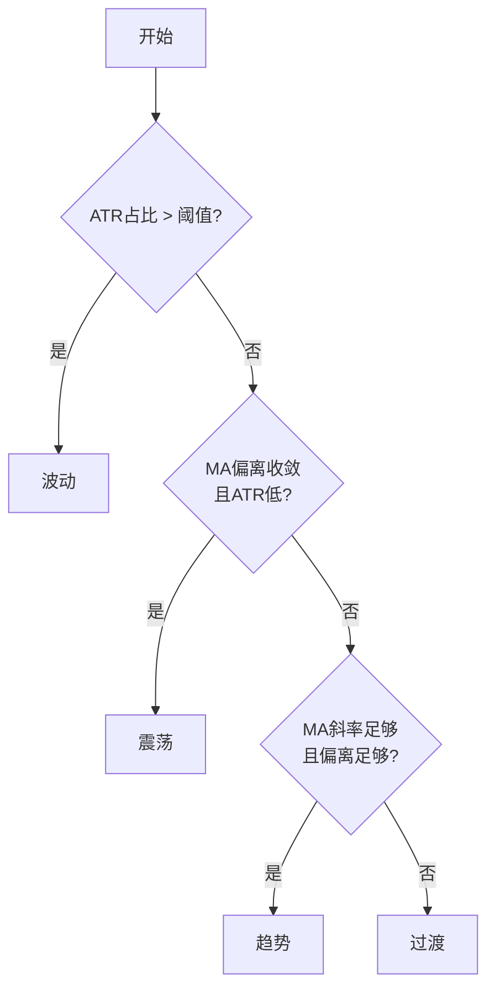

# 四维策略详解

## 概述

四维策略（4D Strategy）是系统的核心决策引擎，其设计理念来源于「管住手下单前四维自检卡」的自动化实现。策略从**基本面（F）、技术面（T）、资金面（C）**三个维度进行综合研判，配合时间维度（多周期共振）构成完整的决策框架。

核心流水线：

```
F(背景偏置) → T(触发/方向) → C(确认/强度) → 风控硬闸门
```

---

## 四个维度详解

### F — 基本面维度

基本面维度提供中长期方向偏置，基于基差、库存等基本面数据计算。

| 属性 | 说明 |
|---|---|
| **取值范围** | [-100, 100] |
| **数据来源** | `fundamentals.json`（`fundamental_feed.py` 盘前刷新） |
| **数据接口** | AkShare 基差 / 库存数据 |
| **缺失处理** | 中性 0（不阻断信号） |

```python
# F 维度评分函数
score_F(symbol, date_str)  # 返回 ∈ [-100, 100]
```

F 维度包含两个子因子：

- **F_basis**：基差因子 — 基差结构反映现货-期货供需关系
- **F_seasonal**：季节性因子 — 品种基本面的季节性规律

!!! note "实盘 vs 回测"
    基本面 F 在实盘与回测中使用同一数据源（`fundamentals.json`），不存在前视偏差风险。minishare token 暂无 `fut_basis` 权限，暂留 AkShare 作为数据源。

### T — 技术面维度

技术面维度是信号触发的核心，基于 8 大技术策略 + 市场状态（regime）路由 + 去相关合成计算。

| 属性 | 说明 |
|---|---|
| **取值范围** | [-100, 100] |
| **计算函数** | `compute_T(df, cfg, group, symbol)` |
| **输入** | 日线 DataFrame（OHLCV） |
| **输出** | `(T_score, regime, rdesc)` |

#### 8 大策略清单

| 策略 | 类型 | 说明 |
|---|---|---|
| `ma_break` | 趋势 | MA 突破（价格 > MA20 > MA60 看多） |
| `dma` | 趋势 | 双均线金叉/死叉（MA5 vs MA20） |
| `turtle` | 趋势 | 海龟策略（唐奇安通道 + 55 日过滤） |
| `donchian` | 趋势 | 通道突破（20 日高低点） |
| `pullback` | 趋势 | 回踩策略（MA20 附近回踩确认） |
| `boll` | 均值回归 | 布林带（触及下轨看多，上轨看空） |
| `rsi` | 均值回归 | RSI 超买超卖（30/70 阈值） |
| `seasonal` | 季节性 | 同月历史收益统计 + Z-Score 过滤 |

#### 市场状态（Regime）分类

`classify_regime()` 根据 ATR 占比、MA 偏离度、MA 斜率三个指标将市场划分为四种状态：



| 状态 | 判定条件 | 策略侧重 |
|---|---|---|
| **趋势** | MA 斜率高 + 偏离大 | 趋势策略权重 1.0，均值回归 0.3 |
| **震荡** | MA 偏离收敛 + ATR 低 | 均值回归权重 1.0，趋势 0.3 |
| **波动** | ATR 占比偏高 | 趋势 0.5，均值回归 0.2，防御为主 |
| **过渡** | 不满足以上任何条件 | 全部策略 0.5 等权 |

#### 策略簇与去相关合成

8 个策略按经济含义聚为 **3 个簇**，通过去相关机制消除共线放大效应：

```mermaid
graph LR
    subgraph 趋势簇[趋势簇 trend]
        MA[ma_break]
        DMA[dma]
        TUR[turtle]
        DON[donchian]
        PULL[pullback]
    end

    subgraph 均值回归簇[均值回归簇 mean]
        BOLL[boll]
        RSI[rsi]
    end

    subgraph 季节性簇[季节性簇 seasonal]
        SEAS[seasonal]
    end

    趋势簇 -->|簇投票 mean| CV[簇投票值]
    均值回归簇 -->|簇投票 mean| CV
    季节性簇 -->|簇投票 mean| CV
    CV -->|簇间加权合成| T[T_score ∈ [-100,100]]
```

去相关设计包含三重机制（P-A 整改）：

1. **簇投票（Cluster Vote）**：同簇共线策略先坍缩为「簇投票」（簇内均值），避免 5 个趋势策略同向 = "5 次投同一方向" 导致 T 顶满 100。

2. **拥挤降权（Crowd Penalty）**：趋势簇内部一致度过高（> 0.8）时，对该簇贡献打折。一致度越高降权越多，最大降幅为 `crowd_pen`（默认 0.35，即打 65 折），抑制趋势末端追高杀低。

    ```
    over = min(1.0, (consensus - crowd_thresh) / (1 - crowd_thresh))
    crowd_factor = max(0, 1 - crowd_pen * over)
    ```

3. **反向阻尼（Contrarian Damp）**：当趋势簇与均值回归簇方向相反时（动量末端背离），整体 T 幅值再打折。反向程度越大，阻尼越强，最大阻尼系数 `contrarian_damp`（默认 0.25）。

#### 季节性分组加权（P-D）

对于农产品、化工等强季节性品种，季节性策略的权重可通过 `seasonal_boost` 配置按品种分组提升：

- 配置项：`cfg["seasonal_boost"]`
- 参数：`global_mult`（全局倍率）× `by_group[group]`（分组倍率）
- 仅当 `enabled=True` 且传入品种分组时生效

### C — 资金面维度

资金面维度提供信号强度确认，反映资金流入流出方向。

| 属性 | 说明 |
|---|---|
| **取值范围** | [-100, 100] |
| **历史回测** | `score_C()` — 龙虎榜历史数据（`cpos_cache.json`） |
| **实时实盘** | `compute_C_flow()` — minishare 快照差分 + da龘 tick 订单流 |
| **缺失处理** | 中性 0（不阻断信号） |

#### 实时 C_flow 计算

实盘环境下，`FlowAggregator` 类累积 minishare 60s 快照数据，通过差分计算净流入速率：

```
净流入代理 = 价格变动 × 持仓变动
  · 价涨仓增 = 资金流入（accumulation）→ 看多
  · 价跌仓减 = 资金流出（distribution）→ 看空
```

若持仓变动不可用，则用成交量变动替代。da龘 tick 订单流数据作为加权项叠加（同向增强，反向制衡）。

### 时间维度

时间维度体现在多周期共振设计中：

- **T_D**：日线级别 T 分数（用于回测方向定标）
- **T_5m**：5 分钟级别 T 分数（用于实盘触发）

实盘采用 5 分钟出场粒度，回测验证显示全市场 5m 出场带来约 94% 的改善。

!!! warning "方向源分歧"
    回测用日线 T_D 定方向、实盘用 T_5m 定方向，4070 日样本分歧率为 **48.4%**。这一差异由 `direction_source_monitor` 模块专门监控。详见 [方向源监控](direction-monitor.md)。

---

## 信号合成逻辑

### 背景偏置合成

三维度通过加权求和合成背景偏置 `bias_G`：

```
bias_G = w_T * T + w_F * F + w_C * C
```

默认权重（可通过 `cfg["combine_weights"]` 配置）：

| 维度 | 默认权重 |
|---|---|
| T（技术面） | 0.60 |
| F（基本面） | 0.25 |
| C（资金面） | 0.15 |

#### GA 权重优化

系统支持遗传算法优化各维度权重。`ga_weights_cache.json` 中存储各品种的最优权重，实盘运行时自动加载并覆盖默认权重：

```python
set_ga_weights_for_symbol(symbol)  # 每轮 evaluate 前调用
```

权重优化走 GA 六因子模型，因子包括：

| 因子 | 来源 |
|---|---|
| T_trend | T 维度趋势簇子因子 |
| T_mean | T 维度均值回归簇子因子 |
| T_seasonal | T 维度季节性子因子 |
| F_basis | F 维度基差子因子 |
| F_seasonal | F 维度季节性子因子 |
| C | 资金面 C |

可选扩展因子：`SR_breakout`（支撑阻力突破强度）、`V_vol`（波动率因子）。

### 触发判定

信号触发需要同时满足两个条件：

1. **方向条件**：`dir_T`（T 分数的方向符号）非零
2. **强度条件**：`|T| ≥ T_thresh` 且 `|bias_G| ≥ bias_hard`

其中阈值按品种、按市场状态差异化设置：

```
bias_hard_dict:
  趋势 = base
  波动 = base + 5
  震荡 = base + 10
```

震荡市阈值最高（需要更强的偏置才出手），趋势市最低。

### HMM 市场状态调制（实盘专属）

实盘模式下，HMM 识别的市场状态可进一步调制触发阈值：

| HMM 状态 | 阈值乘数 |
|---|---|
| `trend_up` / `trend_down` | 0.90（降低阈值，顺势更易触发） |
| `choppy` | 1.15（提高阈值，震荡需更强信号） |
| `high_vol` | 1.25（大幅提高阈值，高波动少出手） |

!!! note "回测隔离"
    HMM 仅在实盘路径中使用，回测路径不传入 `hmm_label` 参数，HMM 永不进入回测计算，从机制上杜绝前视偏差红线。

---

## T 分数计算原理

T 分数的计算位于 `compute_T()` 函数（`four_dim_strategy.py`），核心逻辑也提炼于 `t_score_utils.py` 作为纯函数工具。

### 计算流程

```mermaid
flowchart TD
    A[输入日线DF] --> B[8策略计算信号<br/>sig ∈ {-1, 0, 1}]
    B --> C[Regime分类<br/>classify_regime]
    C --> D[簇投票<br/>cluster_vote]
    D --> E[簇内一致度计算<br/>cluster_consensus]
    E --> F{趋势簇一致度<br/>> crowd_thresh?}
    F -->|是| G[拥挤降权<br/>crowd_penalty]
    F -->|否| H[趋势簇贡献不变]
    G --> I[三簇加权求和]
    H --> I
    I --> J{趋势与均值回归<br/>反向?}
    J -->|是| K[反向阻尼<br/>contrarian_damping]
    J -->|否| L[幅值不变]
    K --> M[归一化到[-100,100]]
    L --> M
    M --> N[输出 T_score]
```

### 核心公式

**簇投票**：

```
cluster_vote[c] = mean(sig[m] for m in cluster_members[c])
cluster_consensus[c] = proportion of members agreeing with vote direction
```

**拥挤降权系数**（仅趋势簇）：

```
if consensus > crowd_thresh:
    over = min(1.0, (consensus - crowd_thresh) / (1 - crowd_thresh))
    crowd_factor = max(0, 1 - crowd_pen * over)
else:
    crowd_factor = 1.0
```

**三簇加权求和**：

```
trend_contrib = cw["trend"] * cluster_vote["trend"] * crowd_factor
mean_contrib = cw["mean"] * cluster_vote["mean"]
seas_contrib = cw["seasonal"] * cluster_vote["seasonal"]
raw = trend_contrib + mean_contrib + seas_contrib
```

**反向阻尼**：

```
if trend_contrib * mean_contrib < 0:  # 方向相反
    div = min(|trend_contrib|, |mean_contrib|) / (|trend_contrib| + 1e-9)
    raw = raw * (1.0 - contrarian_damp * div)
```

**归一化**：

```
T = copysign(min(100, |raw| / maxw * 100), raw)
```

其中 `maxw` 为基础簇权重之和（不含 seasonal_boost 加权，保证季节性不触发时 T 分布不被稀释）。

---

## Pipeline 调用接口

`pipeline()` 函数是四维策略的统一入口：

```python
result = pipeline(
    symbol,  # 品种代码，如 "SA"
    df_daily,  # 日线 DataFrame
    df_5m=None,  # 5分钟K线（可选，用于 T_5m）
    cfg=DEFAULT_CONFIG,  # 配置
    date=None,  # 当前交易日（用于查 F/C 历史）
    c_override=None,  # 实盘实时 C_flow 覆盖
    F_override=None,  # F 覆盖（调试/消融用）
    ablate=None,  # 消融实验："F"/"C"/"T" 置中性
    hmm_label=None,  # HMM 市场状态（实盘专属）
    risk_state=None,  # 实时风控状态（实盘前置否决）
    feat_mgr=None,  # 特性管理器
    sentiment_label=None,  # 情绪标签
    sr_result=None,  # 支撑阻力结果
)
```

### 返回字段摘要

| 字段 | 说明 |
|---|---|
| `F` | 基本面评分 [-100, 100] |
| `T_D` | 日线 T 分数 [-100, 100] |
| `T_5m` | 5 分钟 T 分数（如有） |
| `C` | 资金面评分 [-100, 100] |
| `bias_G` | 合成背景偏置 |
| `dir_T` | T 方向（-1/0/1） |
| `regime` | 市场状态（趋势/震荡/波动/过渡） |
| `triggered` | 是否触发信号 |
| `risk_blocked` | 是否被风控阻断 |
| `risk_block_reason` | 风控阻断原因 |
| `T_thresh_eff` | 生效的 T 阈值 |

---

## 风控硬闸门

信号生成后，还需经过风控硬闸门的多重检查才能最终放行。风控闸门包括：

1. **风险锁定前置否决**：风控状态为 LOCKED / HALTED 时直接返回空信号
2. **风险门禁检查**：风险预算手数 / Kelly 缩放 / 保证金约束 / 涨跌停闸门
3. **信号质量门槛**：`SIGNAL_QUALITY_MIN_SCORE = 60`，低于 60 分的信号不开仓

详见 [风控体系](risk-management.md)。
