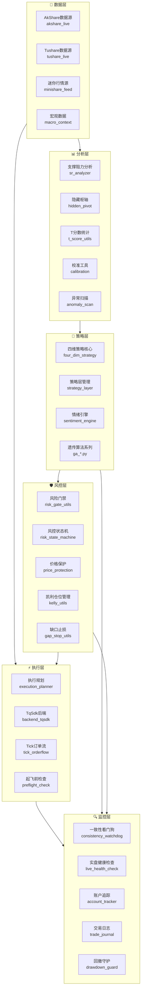
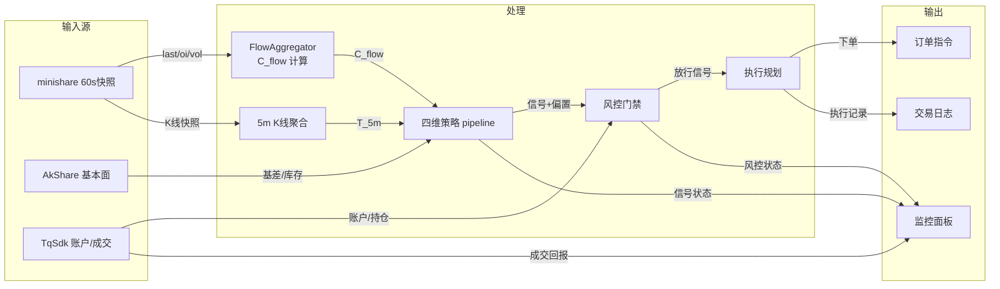
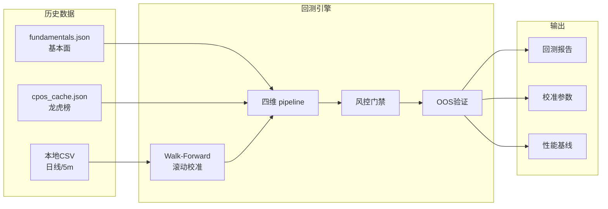
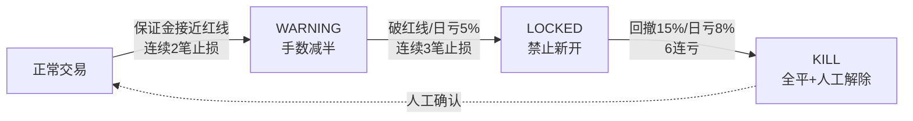

# 整体架构概览

## 系统定位

Futures OrderFlow 是一套基于订单流数据的多维度期货量化交易策略框架，集成四维策略引擎、多层风控体系、遗传算法优化、回测验证与实盘执行能力。系统覆盖从数据接入、信号生成、风险管控到交易执行的全链路。

---

## 分层架构

系统采用自下而上的六层架构设计，各层职责明确、单向依赖：

---

## 各层职责说明

### 📡 数据层

数据层负责多源行情数据的接入与标准化，是整个系统的输入基础。

| 模块 | 职责 | 主要数据源 |
|---|---|---|
| `minishare_feed.py` | 迷你行情源（主力实时） | minishare `rt_fut_k` 60s 快照 |
| `akshare_live.py` | AkShare 数据源（历史/基本面兜底） | AkShare / sina |
| `tushare_live.py` | Tushare 数据源 | Tushare Pro |
| `macro_context.py` | 宏观数据上下文 | 宏观经济指标 |

!!! note "数据源分工"
    实时路径（价格 / 5 分钟 K 线 / 资金面 C_flow）已全部 minishare 化；仅历史回测 5 分钟数据与基本面数据仍依赖免费源（sina / akshare），因为 minishare token 无对应历史 / 基本面端点权限。

### 📊 分析层

分析层提供技术分析工具与统计方法，为策略层提供因子与指标计算能力。

| 模块 | 职责 |
|---|---|
| `sr_analyzer.py` | 支撑阻力位检测与突破强度评估 |
| `hidden_pivot.py` | 隐藏枢轴点检测 |
| `t_score_utils.py` | T 分数统计检验与去相关合成逻辑 |
| `calibration.py` | 策略参数校准工具 |
| `gbm_garch.py` | GBM-GARCH 波动率模型 |
| `regime_hmm.py` | 市场状态 HMM 隐马尔可夫识别 |

### 🧠 策略层

策略层是系统的决策核心，基于四维策略框架生成交易信号。

| 模块 | 职责 |
|---|---|
| `four_dim_strategy.py` | **四维策略核心引擎** — F/T/C 三维评分 + 信号合成 + 风控闸门 |
| `strategy_layer.py` | 8 大技术策略实现 + 市场状态（regime）分类路由 |
| `sentiment_engine.py` | 市场情绪引擎（情绪因子辅助信号判断） |
| `ga_factor_miner.py` | 遗传算法因子挖掘 |
| `ga_six_factor.py` | 六因子模型（GA 优化权重） |
| `ga_tpsl_optimizer.py` | 止盈止损参数优化 |
| `ga_oos_validation.py` | 样本外（OOS）验证 |

!!! info "四维策略流水线"
    策略核心流水线：**F（基本面偏置）→ T（技术面触发/方向）→ C（资金面确认/强度）→ 风控硬闸门**。三维度加权合成背景偏置 `bias_G`，配合 T 维度的触发阈值判定最终信号。详见 [四维策略详解](four-dim-strategy.md)。

### 🛡️ 风控层

风控层是系统的安全保障，采用多层级、多维度的风险防控体系。

| 模块 | 职责 |
|---|---|
| `risk_gate_utils.py` | **风险门禁** — 仓位计算 + 多维度约束（风险预算/Kelly/保证金/涨跌停） |
| `risk_state_machine.py` | **风控状态机** — NORMAL→WARNING→LOCKED 状态流转 + 硬熔断 KillSwitch |
| `price_protection.py` | 价格保护 — 滑点检测 / 异常价格过滤 |
| `kelly_utils.py` | 凯利公式仓位计算 |
| `gap_stop_utils.py` | 缺口止损逻辑 |

!!! warning "双轨风控架构"
    系统采用**双轨风控**设计：
    - **轨 1（状态机 + KillSwitch）**：保证金红线 / 日亏停机 / 连续止损 → 软降档 + 硬熔断
    - **轨 2（drawdown_guard）**：动态权益峰值 → 多档渐变回撤降险（5% / 10% / 15%）
    - **合流规则**：`combined = min(rsm_scale, ddg_scale)` — 取较严者，杜绝双重惩罚

    详见 [风控体系](risk-management.md)。

### ⚡ 执行层

执行层负责交易指令的规划、路由与实际下单。

| 模块 | 职责 |
|---|---|
| `execution_planner.py` | 执行规划 — 出场策略 / 分批执行 / 滑点优化 |
| `backend_tqsdk.py` | TqSdk 经纪商后端 — 实盘下单接口 |
| `tick_orderflow.py` | Tick 级订单流处理 — 逐笔数据分析 |
| `preflight_check.py` | 起飞前检查 — 实盘启动前的环境与配置校验 |

### 🔍 监控层

监控层负责实盘运行时的健康状态监控、异常告警与账户追踪。

| 模块 | 职责 |
|---|---|
| `consistency_watchdog.py` | **一致性看门狗** — 训练/服务参数一致性校验 |
| `live_health_check.py` | 实盘健康检查 — 行情连通性 / 心跳 / 异常检测 |
| `account_tracker.py` | 账户追踪 — 权益 / 保证金 / 持仓实时监控 |
| `trade_journal.py` | 交易日志 — 成交记录 / 绩效统计 |
| `drawdown_guard.py` | 回撤守护 — 账户峰值回撤分档降险 |

---

## 数据流向

### 实盘数据流向

### 回测数据流向

---

## 核心设计原则

### 1. 纯函数优先

核心计算逻辑（T 分数合成、风险门禁计算、凯利仓位等）均采用纯函数设计，便于单元测试与独立验证。`t_score_utils.py`、`risk_gate_utils.py` 等模块从主流程中提炼而出，专注于单一计算职责。

### 2. 配置驱动

策略阈值、风险参数、品种配置均可通过 `trade_config.json` / `calibration_params.json` 等配置文件动态调整，无需修改代码。支持分品种覆盖、分组加权等精细化配置。

### 3. 红线意识

系统内置多条「红线」机制，用于防范已知风险：

| 红线编号 | 内容 | 处理方式 |
|---|---|---|
| 红线① | T_D 与 T_5m 方向源分歧 | 量化监控 + 告警，不阻断信号 |
| 红线③ | 训练/服务参数不一致 | 看门狗报告 + 需复验标注 |
| 红线④ | 前视偏差（回测） | 回测路径严格隔离实时数据 |

### 4. 渐进式风控

风险控制采用渐进式设计，从软警告到硬熔断逐级升级，避免「一刀切」：

---

## 品种覆盖

系统支持国内四大期货交易所的 50+ 品种，按板块分组管理：

| 交易所 | 板块 | 代表品种 |
|---|---|---|
| SHFE 上期所 | 有色 / 贵金属 / 黑系 / 能源 / 化工 | cu, al, au, ag, rb, hc, bu, ru |
| INE 上期能源 | 能源 / 航运 | sc 原油, ec 欧线 |
| DCE 大商所 | 黑系 / 化工 / 农产品 / 能源 | i, J, JM, m, y, p, c, pg |
| CZCE 郑商所 | 化工 / 农产品 | FG, SA, MA, TA, SR, CF, RM, OI |
| GFEX 广期所 | 有色 | si 工业硅, lc 碳酸锂 |

!!! warning "禁用品种"
    经 walk-forward OOS 验证为负期望的品种会被加入 `DISABLED_SYMBOLS` 硬禁列表，禁止实盘/纸面出信号。部分品种（如 hc）支持自适应恢复——当市场结构变化、近期 walk-forward 转正时自动解除屏蔽。
