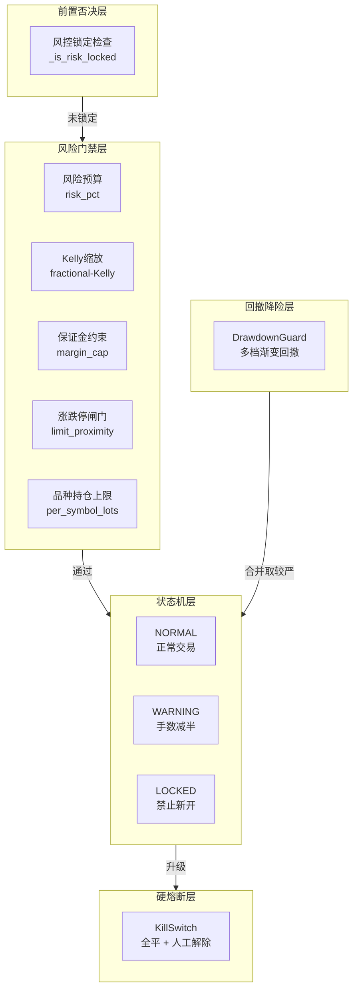
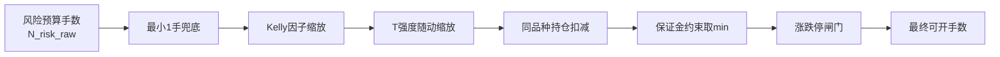
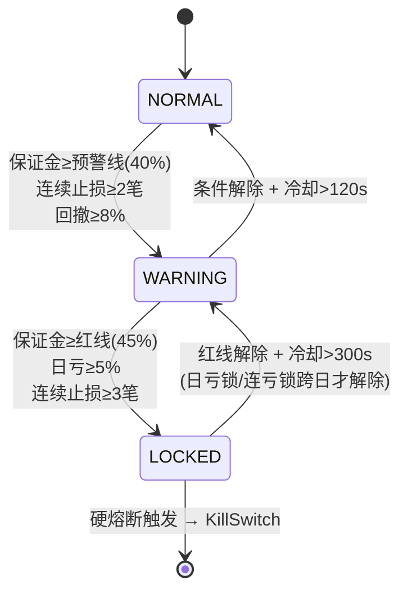
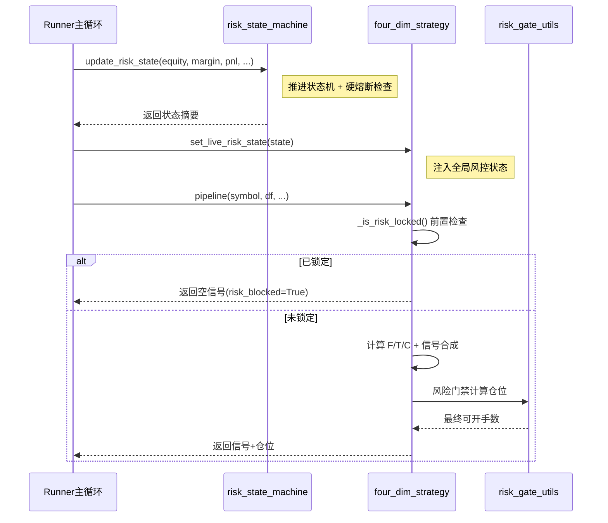

# 风控体系

## 概述

风控体系是期货策略系统的生命线。本系统采用**多层级、渐进式、双轨并行**的风控架构，从信号生成前的前置否决，到开仓时的仓位约束，再到账户级的状态机熔断，形成纵深防御体系。



---

## 双轨风控架构

系统采用**双轨风控**设计（2026-08-25 P1-15 定稿），两轨独立运行、合并取严：

| 轨 | 负责模块 | 职责 | 特点 |
|---|---|---|---|
| **轨 1** | `risk_state_machine` + `KillSwitch` | 保证金红线 / 日亏停机 / 连续止损 → 状态机 + 硬熔断 | 事件驱动、状态明确 |
| **轨 2** | `drawdown_guard` | 动态权益峰值 → 多档渐变回撤降险 | 渐变式、跨重启持久化 |

### 合并规则

```
combined_scale = min(rsm_scale, ddg_scale)
```

取两轨中较严的缩放系数，杜绝双重惩罚。在 15% 回撤处二者对齐（ddg = 0.0，KILL 硬熔断），形成双保险而非重复惩罚。

### 统一调用接口

```python
import risk_state_machine as rsm

rsm.init_dual_track()  # 启动时调用一次
scale_info = rsm.get_combined_risk_scale()  # 每轮开仓前调用

if scale_info["locked"]:
    # 禁止开仓
    pass
sig["lots"] = int(sig["lots"] * scale_info["combined"])
```

返回字段：

| 字段 | 说明 |
|---|---|
| `combined` | 合并后的缩放系数 = min(rsm_scale, ddg_scale) |
| `rsm_scale` | 状态机侧缩放（0.0 / 0.5 / 1.0） |
| `ddg_scale` | 回撤守护侧缩放（1.0 / 0.7 / 0.5 / 0.0） |
| `locked` | 是否禁止新开仓 |
| `rsm_state` | 状态机当前状态字符串 |
| `dd_tier` | 回撤守护当前档位（0=正常，1-3=对应水位线档） |

---

## 风险门禁（Risk Gate）

风险门禁是开仓时的第一道防线，负责计算实际可开手数并施加多重约束。核心计算逻辑提炼于 `risk_gate_utils.py`，以纯函数形式提供。

### 约束层级



### 1. 风险预算手数

基于单笔风险比例（`risk_pct`）与止损点数计算：

```
risk_per_hand = stop_pts * multiplier
risk_budget = equity * (risk_pct / 100)
N_risk_raw = int(risk_budget // risk_per_hand)
```

### 2. 最小 1 手兜底

当风险预算不足 1 手时，强制开 1 手并标注超风险（`over_risk=True`）。设计意图：**不裸奔，但不加仓**。

### 3. Kelly 因子缩放

应用 Fractional-Kelly 缩放，根据信号边缘（edge）动态调整仓位：

- `kelly_slope = 2.0`：edge → 仓位缩放斜率（越大越激进）
- `kelly_min = 0.6`：缩放下限
- `kelly_max = 1.2`：缩放上限

!!! warning "历史教训"
    P1-4 整改：原 Kelly 上限为 1.6x，在弱/中置信品种上导致过度杠杆→反向加杠杆。已将上限收紧至 1.2x。

### 4. T 强度随动缩放

信号刚过阈值时降仓，强度足够时满仓：

- `|T| ≥ 1.5 × T_thresh`：满仓（缩放 1.0）
- `|T|` 刚过阈值：按比例线性缩放

### 5. 保证金约束

```
margin_per_hand = price * multiplier * margin_rate
N_margin = int((equity * margin_cap_pct - used_margin) // margin_per_hand)
N_final = min(N_risk, N_margin)
```

- `margin_cap_pct = 30%`（单品种保证金占比上限）
- `portfolio_margin_cap_pct = 60%`（组合保证金占比上限）

### 6. 涨跌停闸门（gate3）

当价格接近涨跌停板（`limit_proximity = 0.9`）时，禁止追涨杀跌方向开仓，防止流动性枯竭时无法出场。

---

## 风控状态机

`RiskStateMachine` 实现账户级「会认输」的风控，状态由账户快照推进，处理「今天手气差」的场景。

### 状态定义

| 状态 | 说明 | 仓位缩放 |
|---|---|---|
| **NORMAL** | 正常交易 | 1.0 |
| **WARNING** | 预警状态 — 保证金接近红线 / 连续 2 笔止损 | 0.5 |
| **LOCKED** | 锁定状态 — 破红线 / 日亏 5% / 连续 3 笔止损 | 0.0（禁止新开） |

### 状态转换



### 触发阈值

| 参数 | 默认值 | 说明 |
|---|---|---|
| `RED_LINE` | 0.45 | 保证金使用率红线（禁新开） |
| `WARN_LINE` | 0.40 | 预警线 |
| `DAILY_LOSS_STOP` | 0.05 | 当日亏损停机线（强制冻结） |
| `SINGLE_LEG` | 0.30 | 单笔保证金占比上限 |
| `CONSEC_WARN` | 2 | 连续止损 ≥ 2 笔 → WARNING |
| `CONSEC_LOCK` | 3 | 连续止损 ≥ 3 笔 → LOCKED |
| `DRAWDOWN_TRIGGER` | 0.08 | 回撤 8% 触发降档至 WARNING |
| `LOCK_RELEASE_SEC` | 300 | LOCKED 解锁冷却时间（秒） |
| `WARN_RELEASE_SEC` | 120 | WARNING 回 NORMAL 冷却时间（秒） |

### 连续止损降档

除了状态机的档位切换，连续止损还会进一步按比例缩仓：

```
loss_factor = max(LOSS_FLOOR, LOSS_DECAY ^ consec_losses)
```

- `LOSS_DECAY = 0.8`：每笔连续止损打 8 折
- `LOSS_FLOOR = 0.2`：手数缩放封底（最低 20%）

### 日亏锁与连亏锁的跨日特性

当日亏损触发的 LOCKED 和连续止损触发的 LOCKED **跨日才解除**，不因盘中浮亏回吐自动解锁。这避免了「上午亏到停机，下午浮盈回来又开始交易」的风险。每日收盘后调用 `reset_daily()` 重置。

### 可配置化

连续止损阈值可从 `trade_config.json` 读取配置（`consec_loss_gate.warn` / `consec_loss_gate.lock`），缺省回退到内置常量。

---

## 硬熔断（KillSwitch）

`KillSwitch` 是账户级的最后一道保险，处理「模型或人已经失控」的极端情况。与软状态机的核心区别：

| 特性 | 软状态机 | 硬熔断 |
|---|---|---|
| 触发后操作 | 禁止新开 / 缩仓 | **全平 + 停机** |
| 恢复方式 | 自动恢复（冷却后） | **永不自动恢复，需人工解除** |
| 持久化 | 内存态 | 落盘 JSON，跨重启保持 |

### 熔断阈值

| 阈值 | 触发值 | 说明 |
|---|---|---|
| `KILL_DRAWDOWN` | 0.15 | 账户权益自峰值回撤 ≥ 15% |
| `KILL_DAILY_LOSS` | 0.08 | 当日亏损占权益 ≥ 8%（软停机线是 5%） |
| `KILL_CONSEC_LOSSES` | 6 | 连续止损 ≥ 6 笔 |

### 熔断动作

1. 设置 `halted = True`
2. 生成全平清单（`flatten_plan`）
3. 状态落盘 `killswitch_state.json`
4. 记录熔断历史（保留最近 50 条）
5. 等待人工确认（`ack`）后才允许尝试恢复

### 持久化设计

熔断状态写入 `killswitch_state.json`，包含：

- `halted`：是否熔断
- `reason`：熔断原因
- `triggers`：命中的硬线列表
- `triggered_at`：触发时间戳
- `metrics`：触发时的账户指标（权益、峰值、回撤、日亏、连亏数）
- `flatten_plan`：全平清单
- `history`：历次熔断/解除记录
- `ack`：用户是否已确认
- `reset_at`：最近一次人工解除时间

!!! danger "防「重启洗白」"
    熔断状态持久化到磁盘，进程重启后仍然是熔断态。必须人工在面板点击「解除熔断」才能恢复。

---

## 回撤守护（DrawdownGuard）

回撤守护负责基于账户动态权益峰值的多档渐变式降险，是双轨风控的轨 2。

### 分档设计

| 档位 | 回撤幅度 | 缩放系数 | 说明 |
|---|---|---|---|
| 0 档 | < 5% | 1.0 | 正常交易 |
| 1 档 | 5% ~ 10% | 0.70 | 轻度降险 |
| 2 档 | 10% ~ 15% | 0.50 | 中度降险 |
| 3 档 | ≥ 15% | 0.00 | 禁止新开（与 KILL 对齐） |

### 特点

- **渐变式**：回撤越大，仓位越小，避免单一大幅回撤的冲击
- **跨重启持久化**：峰值权益水位线持久化，重启后不丢失
- **独立于状态机**：与状态机并行运行，取较严者生效

---

## 分品种专项风控

基于回测结论（2026-08-16），对特定品种实施专项风控收紧：

| 品种 | 单笔保证金上限 | 强制止损 | 说明 |
|---|---|---|---|
| **JM 焦煤** | 18%（默认 30%） | 是 | 实盘胜率 27.2%，低胜率靠 R 乘数盈利，防单笔大亏侵蚀期望 R |
| **J 焦炭** | 18%（默认 30%） | 是 | 实盘胜率 34.2%，同上 |

```python
# 调用 risk_guard 时传入 symbol 即可自动应用
rg = risk_guard(equity, used_margin, daily_pnl, proposed_margin, symbol="JM")
```

### SA 品种特殊处理

SA（纯碱）对方向源（T_D vs T_5m）最敏感，由 `direction_source_monitor` 模块专项监控。详见 [方向源监控](direction-monitor.md)。

---

## 价格保护

`price_protection.py` 模块负责价格层面的风险防护：

- **滑点检测**：对比下单价格与最新成交价，滑点过大则拒绝下单
- **异常价格检测**：过滤明显异常的报价（如涨跌幅超出合理范围）
- **流动性检查**：涨跌停附近禁止开追仓方向

---

## 一致性监控

`consistency_watchdog.py`（训练/服务一致性看门狗）负责监控实盘参数与 OOS 校验基线的一致性，防止「训练时一套参数，实盘跑另一套」的埋雷风险。

### 检查项

| 检查项 | 说明 | 阈值 |
|---|---|---|
| `train_serve_divergence` | 服务 T 相对基线 T 的偏离 | > 35% 标 `needs_revalidation` |
| `unvalidated` | 品种从未被 OOS 校验（用默认 T 在服务） | — |
| `broken_serving` | 漂移判 broken 且未禁用、未被门控压制 | 计入 `ok=false` |
| `broken_gated` | 漂移判 broken 但已被动态门控压制 | 风险已控，仅提示 |
| `stale` | 重校时间超过 30 天未刷新 | 建议重校 |

### 设计原则

!!! note "只报告、不修正"
    一致性看门狗遵循「只报告、不修正」原则，与红线③一致：不擅自改线上参数。产出结构化差异清单供人工决策。

---

## 风控与策略的交互

### 实时风控状态注入

实盘模式下，`four_dim_live_runner` 在每轮评估前设置全局风控状态：

```python
# runner 调用
set_live_risk_state(state_dict)

# pipeline 内部前置检查
_locked, _lock_reason = _is_risk_locked(risk_state)
if _locked:
    # 直接返回空信号，不执行后续计算
    return {"triggered": False, "risk_blocked": True, ...}
```

回测模式下 `_LIVE_RISK_STATE` 为 `None`，不影响回测逻辑。

### 风控锁定判断

`_is_risk_locked()` 判定逻辑：

1. 状态为 `HALTED` 或 `LOCKED` → 锁定
2. `scale ≤ 0.0` → 锁定
3. 否则 → 未锁定

锁定时返回原因字符串，供日志/面板展示。

---

## 风控调用时序

实盘运行中，风控检查按以下顺序层层递进：


