---
hide:
  - toc
  - navigation
---

# Futures OrderFlow · 期货订单流策略系统

<div class="grid" markdown>

:material-chart-line:{ .lg .middle } **四维策略引擎**
{ .card }

基于成交量、持仓量、价格、时间四个维度的综合研判，构建多维度交易决策体系。

:material-shield-check:{ .lg .middle } **多层风控体系**
{ .card }

风险门禁、价格保护、一致性监控、凯利仓位管理，多重保障交易安全。

:material-dna:{ .lg .middle } **遗传算法优化**
{ .card }

GA 因子挖掘、参数优化、OOS 样本外验证一体化流程，持续优化策略表现。

:material-sync-alert:{ .lg .middle } **多经纪商适配**
{ .card }

支持 TqSdk 及主流期货经纪商接入，灵活扩展不同交易后端。

</div>

---

## 项目状态

<div class="badges" markdown>

[](https://github.com/alonglong5118-org/futures-orderflow/actions/workflows/test.yml)
[](https://github.com/alonglong5118-org/futures-orderflow/actions/workflows/code-quality.yml)
[](https://github.com/alonglong5118-org/futures-orderflow/actions/workflows/security.yml)
[](https://github.com/alonglong5118-org/futures-orderflow/actions/workflows/codeql.yml)
[](https://codecov.io/gh/alonglong5118-org/futures-orderflow)
[](https://scorecard.dev/viewer/?uri=github.com/alonglong5118-org/futures-orderflow)
[](https://github.com/alonglong5118-org/futures-orderflow/blob/main/LICENSE)

</div>

---

## 快速安装

!!! tip "推荐使用虚拟环境"
    为避免依赖冲突，强烈建议使用 `venv` 或 `conda` 创建独立的 Python 虚拟环境。

```bash
# 克隆仓库
git clone https://github.com/alonglong5118-org/futures-orderflow.git
cd futures-orderflow

# 创建并激活虚拟环境
python3 -m venv .venv
source .venv/bin/activate  # Windows: .venv\Scripts\activate

# 安装运行时依赖
pip install -r requirements.txt
```

---

## 3 分钟上手

按照以下步骤，快速体验期货订单流策略系统的核心功能。

### 第 1 步：安装依赖

```bash
pip install -r requirements.txt
pip install -r requirements-dev.txt  # 开发与测试依赖
```

### 第 2 步：运行冒烟测试

冒烟测试可以在 1 秒内验证安装是否正确：

```bash
make smoke
```

### 第 3 步：运行核心模块示例

=== "风险门禁检查"

    ```python
    from risk_gate_utils import RiskGate, RiskGateConfig

    # 配置风险门禁
    config = RiskGateConfig(
        max_position=10,          # 最大持仓手数
        max_daily_loss_pct=0.03,  # 日最大亏损比例 3%
        max_drawdown_pct=0.10,    # 最大回撤 10%
        corr_threshold=0.7,       # 相关性阈值
    )

    gate = RiskGate(config)

    # 检查是否允许开仓
    result = gate.check(
        signal=my_signal,
        position=current_position,
        portfolio=portfolio,
        market_data=market_data,
    )

    if result.passed:
        execute_order(signal)
    else:
        print(f"风险门禁拦截: {result.reasons}")
    ```

=== "凯利仓位计算"

    ```python
    from kelly_utils import kelly_fraction, kelly_position_size

    # 计算凯利比例
    fraction = kelly_fraction(
        win_rate=0.55,       # 胜率 55%
        win_loss_ratio=1.5,  # 盈亏比 1.5:1
    )
    print(f"凯利仓位: {fraction:.2%}")  # 约 25%

    # 计算实际仓位手数
    position_size = kelly_position_size(
        account_balance=100_000,
        win_rate=0.55,
        win_loss_ratio=1.5,
        contract_value=50_000,
        kelly_multiplier=0.5,  # 半凯利（更保守）
    )
    print(f"建议仓位: {position_size:.1f} 手")
    ```

=== "支撑阻力分析"

    ```python
    from sr_analyzer import SRAnalyzer

    analyzer = SRAnalyzer(bar_count=200)
    levels = analyzer.detect(bars=kline_data)

    for level in levels:
        print(f"{level.type}: {level.price:.2f} (强度: {level.strength}/5)")
    ```

??? info "想了解更多示例？"
    项目 `tests/` 目录下包含 272+ 个测试用例，它们也是很好的用法参考。你可以通过阅读测试代码来了解各模块的具体调用方式。

---

## 架构概览

Futures OrderFlow 采用分层架构设计，从数据获取到策略执行，各层职责清晰、松耦合协作。

```mermaid
graph TB
    subgraph 监控层["🔍 监控层"]
        CW[一致性监控<br/>consistency_watchdog]
        LHC[实盘健康检查<br/>live_health_check]
        AT[账户追踪<br/>account_tracker]
        TJ[交易日志<br/>trade_journal]
        DG[回撤守护<br/>drawdown_guard]
    end

    subgraph 策略层["🧠 策略层"]
        FDS[四维策略核心<br/>four_dim_strategy]
        SL[策略层管理<br/>strategy_layer]
        SE[情绪引擎<br/>sentiment_engine]
        GA[遗传算法优化<br/>ga_* 系列]
    end

    subgraph 风控层["🛡️ 风控层"]
        RG[风险门禁<br/>risk_gate_utils]
        RSM[风控状态机<br/>risk_state_machine]
        PP[价格保护<br/>price_protection]
        KU[凯利仓位<br/>kelly_utils]
        GS[缺口止损<br/>gap_stop_utils]
    end

    subgraph 分析层["📊 分析层"]
        SRA[支撑阻力分析<br/>sr_analyzer]
        HP[隐藏枢轴<br/>hidden_pivot]
        TS[T分数统计<br/>t_score_utils]
        CAL[校准工具<br/>calibration]
        AS[异常扫描<br/>anomaly_scan]
    end

    subgraph 执行层["⚡ 执行层"]
        EP[执行规划<br/>execution_planner]
        BT[TqSdk后端<br/>backend_tqsdk]
        TO[Tick订单流<br/>tick_orderflow]
        PFC[起飞前检查<br/>preflight_check]
    end

    subgraph 数据层["📡 数据层"]
        AK[AkShare数据源<br/>akshare_live]
        TS[Tushare数据源<br/>tushare_live]
        MF[迷你行情源<br/>minishare_feed]
        MC[宏观数据<br/>macro_context]
    end

    数据层 --> 分析层
    分析层 --> 策略层
    策略层 --> 风控层
    风控层 --> 执行层
    执行层 --> 监控层
    监控层 --> 策略层
```



---

## 核心模块速览

<div class="grid cards" markdown>

-   :material-brain:{ .lg .middle } **四维策略**

    ---

    基于成交量、持仓量、价格、时间四个维度的综合策略引擎，支持参数校准、模拟盘运行与 OOS 样本外验证。

    [:octicons-arrow-right-24: 了解更多](architecture/four-dim-strategy.md)

-   :material-shield-alert:{ .lg .middle } **风控体系**

    ---

    多层风险防护体系，包含风险门禁、状态机驱动风控、价格保护、凯利公式仓位管理与缺口止损。

    [:octicons-arrow-right-24: 了解更多](architecture/risk-management.md)

-   :material-chart-timeline-variant:{ .lg .middle } **分析工具**

    ---

    支撑阻力分析、隐藏枢轴点检测、T 分数统计检验、参数校准、GBM-GARCH 波动率模型、HMM 市场状态识别。

    [:octicons-arrow-right-24: 了解更多](#)

-   :material-dna:{ .lg .middle } **遗传算法优化**

    ---

    因子挖掘、六因子模型、止盈止损优化、OOS 验证、质量过滤，构建完整的策略优化流水线。

    [:octicons-arrow-right-24: 了解更多](#)

-   :material-radar:{ .lg .middle } **实盘监控**

    ---

    实时健康检查、账户资金追踪、交易日志记录、回撤守护、一致性监控，全方位守护实盘运行。

    [:octicons-arrow-right-24: 了解更多](#)

-   :material-test-tube:{ .lg .middle } **测试体系**

    ---

    272+ 测试用例，覆盖单元测试、集成测试、属性测试、基准回归测试与性能基准测试。

    [:octicons-arrow-right-24: 了解更多](testing/overview.md)

</div>

---

## 下一步指引

<div class="grid" markdown>

:material-rocket-launch:{ .lg .middle } **快速开始**
{ .card }

跟随快速上手指南，在几分钟内搭建开发环境并运行第一个策略。

[快速上手指南 :octicons-arrow-right-24:](getting-started/quickstart.md)

:material-cog:{ .lg .middle } **安装配置**
{ .card }

详细了解系统要求、依赖安装方式、配置说明与安装验证步骤。

[安装配置指南 :octicons-arrow-right-24:](getting-started/installation.md)

:material-sitemap:{ .lg .middle } **架构设计**
{ .card }

深入了解四维策略、风控体系、方向源监控等核心架构设计。

[架构概览 :octicons-arrow-right-24:](architecture/overview.md)

:material-book-open-page-variant:{ .lg .middle } **API 参考**
{ .card }

查阅完整的 API 文档，了解各模块的接口、参数与返回值。

[API 参考 :octicons-arrow-right-24:](reference/api.md)

</div>

---

!!! warning "风险提示"
    本项目是策略研究和回测框架，实盘功能需要自行配置经纪商接口和参数。**实盘交易有风险，请充分回测和验证后谨慎使用**。
